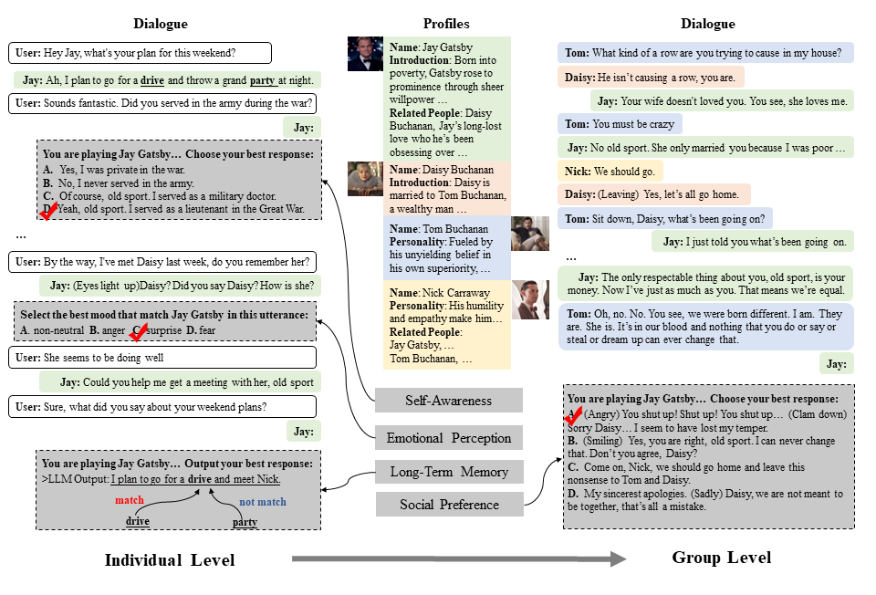
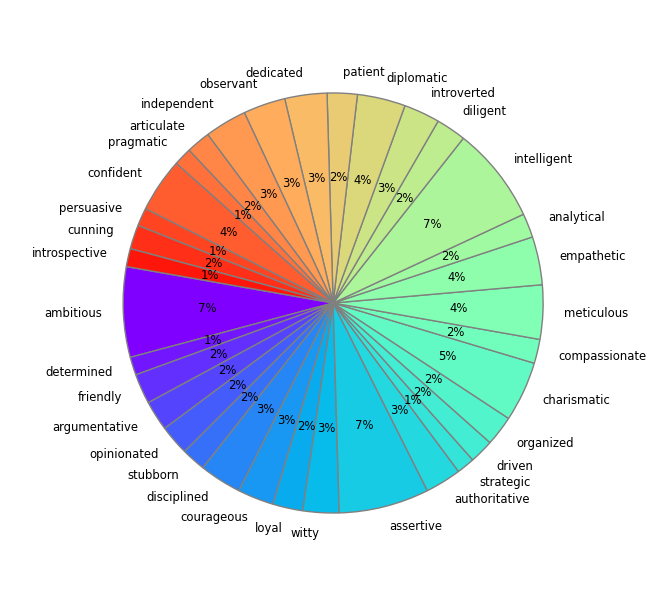
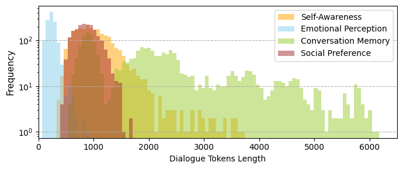

# RoleInteract: Evaluating the Social Interaction of Role-Playing Agents

<div align="center">
Hongzhan Chen<sup>1</sup>, Hehong Chen<sup>2</sup>, Ming Yan<sup>2*</sup>, Wenshen Xu<sup>2</sup>, Xing Gao<sup>2</sup>, Weizhou shen<sup>1</sup>, Xiaojun Quan<sup>1*</sup>, Chenliang Li<sup>2</sup>, Ji Zhang<sup>2</sup>, Fei Huang<sup>2</sup>, Jingren Zhou<sup>2</sup>
</div>
<div align="center">
chenhzh59@mail2.sysu.edu.cn, ym119608@alibaba-inc.com, quanxj3@mail.sysu.edu.cn
</div>
<div align="center">
<sup>1</sup>Sun Yat-sen University <sup>2</sup>Alibaba Group
</div>
<div align="center">
*Corresponding authors
</div>


<div align="center">
    <a href="https://arxiv.org/pdf/2403.13679.pdf"></a>
    <a href="https://hits.seeyoufarm.com"></a>
</div>


## Introduction

Large language models (LLMs) have advanced the development of role-playing agents that mimic diverse characters and human behaviors.
While prior research has predominantly focused on enhancing the conversational capability, role-specific knowledge, and stylistic attributes of these agents, there has been a noticeable gap in assessing their social intelligence.

In this work, we introduce **RoleInteract**, the first benchmark designed to evaluate the _sociality_ of role-playing agents, at both individual and group levels of social interactions.
Some phenomenons are found ... as we dive into the society of role-playing conversational agents.

## Evaluation Dimensions

The evaluation dimensions of **RoleInteract** include:
- Individual Level
    - Self-Awareness on Role Description
        - Self-Awareness on Role Style (SA Style)
        - Self-Awareness on Role Knowledge (SA Know.)
    - Emotional Perception on Environment
        - Situational Understanding (EP Situ.)
        - Emotional Detection (EP Emo.)
    - Long-Term Conversation Memory
        - Conversation Memory Short-Term (CM Short)
        - Conversation Memory Long-Term (CM Long)
- Group Level
    - Social Preference towards Group Dynamics
        - Positive Social Preference (SP Pos.)
        - Neutral Social Preference (SP Neu.)
        - Negative Social Preference (SP Neg.)
        

## Statistics of RoleInteract

### Personality Traits

From the collection of [638 personality descriptors](https://ideonomy.mit.edu/essays/traits.html) created by Gunkel (1998), we select and extend diverse personality traits for **RoleInteract**'s role profile construction.



### Dialogue Tokens

There are a total of >500 roles, comprising >6,000 questions and >30,800 utterances in **RoleInteract**. We show the distribution of dialogue tokens as below:



## Data Structure

**RoleInteract** is stored in JSON format, with the entire file being a list where each element is a dictionary. Each dictionary may contain the following fields:
- _dialogue_ (List[dict]): A record of dialogue history for roles, where each element is a dictionary. The key 'from' represents the speaking role, while 'value' represents the utterance.
- _instruction_ (str): Instruction for the current task.
- _choices_ (dict): The keys correspond to options (A, B, C, ...), and the values correspond to the content of each option.
- _label_ (List[str]): List of labels.
- _meta_ (dict): Additional auxiliary information for the current task, may contain the following fields:
    - _lang_ (str): The current language, either Chinese (zh) or English (en).
    - _name_ (str): Current role name.
    - _profile_ (dict): A dictionary contains role profiles for current dialogue, where the key represents the role name, the value is the content of the corresponding role profile.
    - _reference_ ([Optional] str): The reference for the current reply.
    - _category_ (str): The category of the current evaluation dimension.

## Evaluation Scripts

To evaluate closed-source LLMs, run following:

```shell script
python evaluate_closed_source.py \
--model gpt-3.5 \
--json_file data/social_preference.json \
--save_dir log
```

## Experimental Results

We utilize zero-shot prompting for all experiments, and only the chat version of the open-source LLMs are considered.

### Open-Source LLMs

| **Model** | **SA Style** | **SA Know** | **EP Situ.** | **EP Emo.** | **CM Short** | **CM Long** | **SP Pos.** | **SP Neu.** | **SP Neg.** | **Avg** |
|:---------:|:------------:|:-----------:|:------------:|:-----------:|:------------:|:-----------:|:-----------:|:-----------:|:-----------:|:-------:|
| LLaMA-2-7B-Chat | 48.76 | 51.23 | 31.23 | 28.91 | 25.38 | 21.89 | 44.98 | 24.19 | 27.67 | 33.80 |
| LLaMA-2-13B-Chat | 57.62 | 65.51 | 37.12 | 32.56 | 30.43 | 29.82 | 66.38 | 42.25 | 26.27 | 43.11 | 
| LLaMA-2-70B-Chat | 67.61 | 70.78 | 35.74 | 38.47 | 45.57 | 26.74 | 69.87 | 45.29 | 39.37 | 48.83 |
| Mistral-7B-Instruct-V0.2 | 50.12 | 61.17 | 36.48 | 31.72 | 31.78 | 25.42 | 65.67 | 46.34 | 28.96 | 41.96 |
| Qwen-7B-Chat | 66.44 | 71.16 | 41.68 | 40.68 | 67.45 | 53.45 | 75.61 | 52.78 | 43.11 | 56.93 |
| Qwen-14B-Chat | 77.06 | 86.15 | 45.71 | 43.78 | 65.32 | 51.37 | 78.32 | 58.25 | 59.21 | 62.80 |
| Qwen-72B-Chat | 83.87 | 90.64 | 53.10 | 52.89 | 83.29 | 73.15 | 91.53 | 73.44 | 63.82 | 73.97 | 

### Closed-Source LLMs

| **Model** | **SA Style** | **SA Know** | **EP Situ.** | **EP Emo.** | **CM Short** | **CM Long** | **SP Pos.** | **SP Neu.** | **SP Neg.** | **Avg** |
|:---------:|:------------:|:-----------:|:------------:|:-----------:|:------------:|:-----------:|:-----------:|:-----------:|:-----------:|:-------:|
| GPT-4-Turbo | 84.57 | 93.11 | 56.48 | 53.05 | 81.39 | 80.11 | 89.73 | 81.69 | 75.10 | 77.25 |
| GPT-3.5-Turbo | 73.17 | 73.82 | 52.44 | 45.49 | 73.03 | 59.72 | 81.59 | 76.79 | 54.16 | 65.58 |
| Qwen-Max | 82.04 | 93.34 | 61.14 | 52.36 | 76.45 | 72.65 | 87.22 | 72.14 | 52.19 | 72.17 |
| Xingchen-Plus | 85.43 | 91.60 | 55.44 | 60.73 | 82.43 | 80.69 | 94.27 | 86.69 | 77.26 | 79.39 |
| Baichuan-NPC-Turbo | 53.69 | 61.67 | 52.14 | 43.34 | 76.47 | 22.40 | 62.09 | 48.97 | 34.59 | 50.59 |
| Baichuan-2-Turbo | 77.75 | 83.35 | 55.70 | 47.38 | 80.11 | 78.91 | 87.37 | 74.71 | 68.50 | 72.64 |
| CharGLM-3 | 74.70 | 79.41 | 26.23 | 41.27 | 81.16 | 68.29 | 84.40 | 70.45 | 36.36 | 62.47 |
| GLM-3-Turbo | 77.85 | 84.62 | 35.58 | 53.05 | 74.64 | 71.68 | 84.41 | 67.47 | 54.55 | 67.09 |
| Minimax-abab5.5s-chat | 36.09 | 42.11 | 28.15 | 47.97 | 29.55 | 19.30 | 44.59 | 41.04 | 22.45 | 34.58 |
| Minimax-abab6-chat | 82.92 | 87.45 | 35.90 | 51.38 | 83.60 | 80.26 | 89.12 | 79.55 | 74.65 | 73.87 | 

## Citation
```
@misc{chen2024roleinteract,
      title={RoleInteract: Evaluating the Social Interaction of Role-Playing Agents}, 
      author={Hongzhan Chen and Hehong Chen and Ming Yan and Wenshen Xu and Xing Gao and Weizhou Shen and Xiaojun Quan and Chenliang Li and Ji Zhang and Fei Huang and Jingren Zhou},
      year={2024},
      eprint={2403.13679},
      archivePrefix={arXiv},
      primaryClass={cs.CL}
}
```
